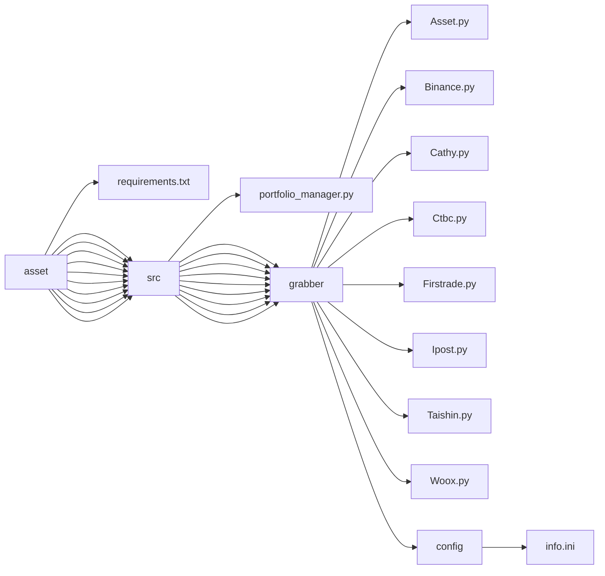

## asset

### Goal
- Build an system to fetch personal total assets

### Method
- API
- crawler

### Install dependencies
```
pip install -r requirements.txt
```

### Directories


### Github Actions
- run automatically (hourly)
