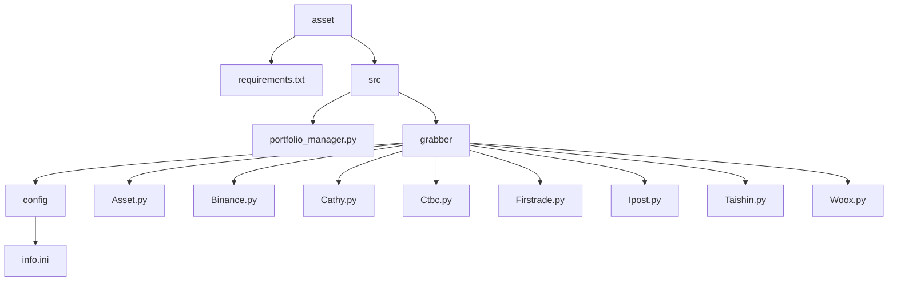

## Asset

### Goal
- Build an system to fetch personal total assets

### Method
- API
- crawler

### Install dependencies
```
pip install -r requirements.txt
```

### Directories


### Github Actions
- run automatically (hourly)

### Credentials
- keep credentials (ini file) under settings

### Follow Up
1. create a db or google sheets to store the data
2. consider more error scenarios
   - exchange/bank maintenance
   - pop up message bug
   - use more try-except blocks to ensure the process runs smoothly
3. create a dash
